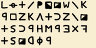

+++
date = '2025-08-04T09:53:27+05:30'
draft = false
title = 'Cipher 408'
+++

```
An old scrap of paper was found in a dusty archive, filled with strange symbols. No one knows who wrote it—but some say it's connected to an infamous cold case. The symbols aren’t just decoration. They hold a message, and maybe even a flag.

Flag format: flag{text}
```



Reverse searching this image will lead you to this wikipedia article.

[https://en.wikipedia.org/wiki/File:Zodiac_Z340_cipher_key.png](https://en.wikipedia.org/wiki/File:Zodiac_Z340_cipher_key.png)

Something about Zodiac, digging deeper, you can uncover information about the zodiac killer and the encrypted messages sent by that person.The cipher was solved after 51 years. 
You can read more about it here and decode it yourself 

[https://blog.wolfram.com/2021/03/24/the-solution-of-the-zodiac-killers-340-character-cipher/](https://blog.wolfram.com/2021/03/24/the-solution-of-the-zodiac-killers-340-character-cipher/)

Final Flag: 

```
flag{THEKILLERSEYESNEVERLEAVETHECODEALONE}
```
