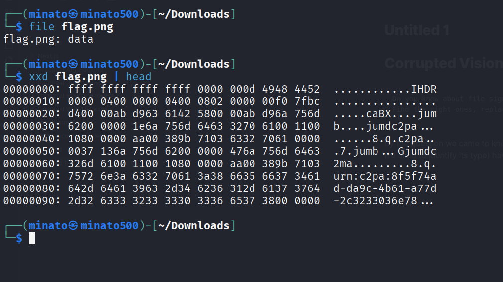
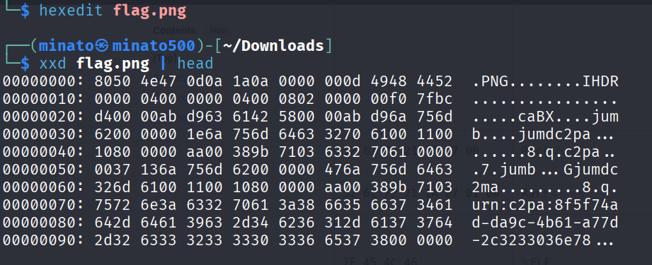
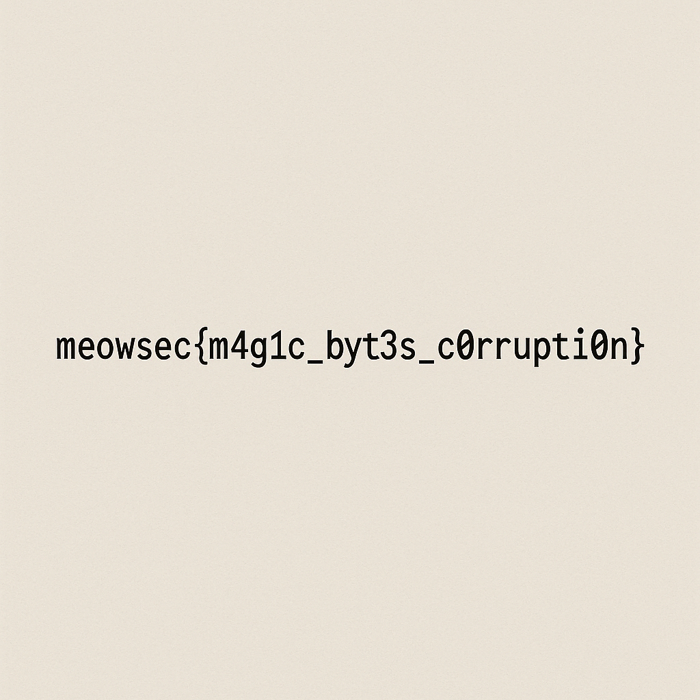

+++
date = '2025-08-04T09:59:22+05:30'
draft = false
title = 'Corrupted Vision'
+++

# Corrupted Vision

```
Do you know about file signatures? This one has some bytes that are not right. Find the right ones, replace it and the flag is yours.
```

While seeing the file extension, it was png but to confirm it we can use the **file** command (It is a shell command for reporting the type of data contained in a file). But it shows as data so something is weird



While looking at the hex we can observe the IDHR chunks that are related to png file, we can conclude that this is a png file in which the **Magic byte** (These are the first few bytes of a file used to identify its type) are altered or removed and by fixing it we can view the image, the magic byte for png is 

```
89 50 4E 47 0D 0A 1A 0A
```

we refer it in [Wikipedia](https://en.wikipedia.org/wiki/List_of_file_signatures), we can use the hexedit tool to fix

 

Now the file is viewable



Final Flag:

```
meowsec{m4g1c_byt3s_c0rrupti0n}
```
