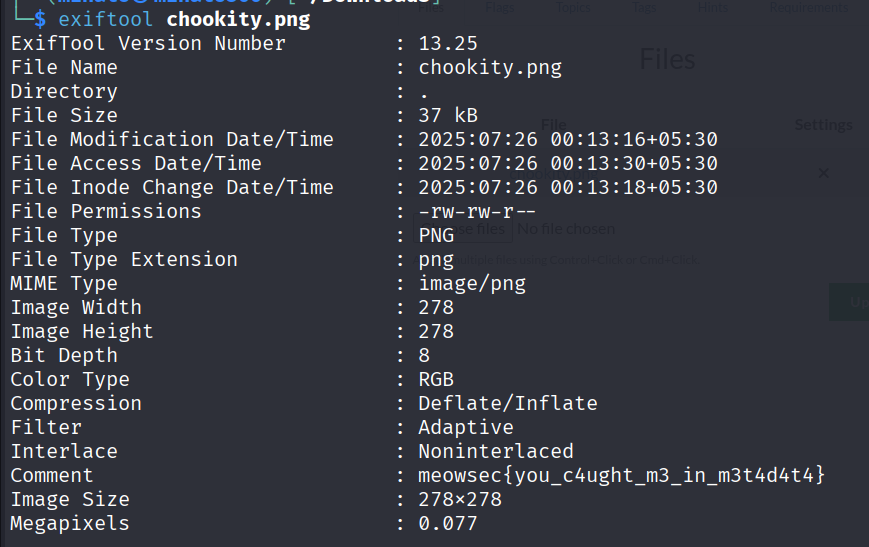

+++
date = '2025-08-04T09:59:22+05:30'
draft = false
title = 'Data about Data'
+++

# Data about Data

```
An image is worth a thousand words… but maybe just one flag. Your task is to inspect this seemingly innocent image and find something hidden but not encrypted. The flag is not in the pixels, but in the details.
```

`Metadata` describes information about a file without being part of the main content itself, it can contains the informations like descriptions, image size, width, height and lot more and exiftool is used for reading, writing, and editing metadata in image, audio, video, PDF, and other types of files



Final Flag:

```
meowsec{you_c4ught_m3_in_m3t4d4t4}
```
