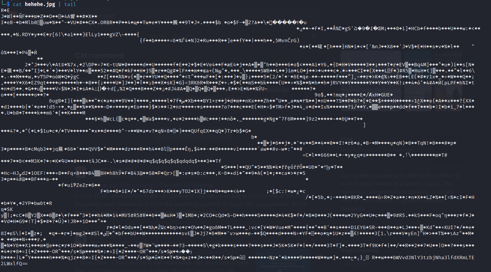

+++
date = '2025-08-04T09:59:22+05:30'
draft = false
title = 'EOF'
+++

# EOF

```
I have hidden some text in this image, I bet no one can find this hehehe..
```

Here a text or flag is hidden in the image, there are various methods to hide the text in the image like hiding in metadata, head or tail and LSB, etc. 

Now checking the **strings or readable character** in the file using the strings command which is a utility in Linux that extracts human-readable text strings from binary files, but the result shows nothing important. 

The challenge title EOF is a hint nudging the user to check the End of the File. Normally strings only considers 3 or more consequtive characters and displays them. The content at the end of the file is encoded in UTF-16, a format that uses 2 bytes to represent ASCII characters instead of 1.

This means that each character uses 2 bytes which means they always have a null byte in between them(00).
For example, B is encoded as `00 57` 

cat is able to give you the full string, or you can xxd and see the very end to find the base64 encoded string that is in UTF-16

```
$xxd hehehe.jpg | tail 
000105b0: 9f3c bdc5 52a7 cf2f 7389 53d4 97b9 c5a9  .<..R../s.S.....
000105c0: 7fec 97b8 aad4 d3fd 92f7 2b4e 7abe 27ee  ..........+Nz.'.
000105d0: 6b9f ccfd c739 e9f8 9fb9 aa57 f899 77dc  k....9.....W..w.
000105e0: bbee 5df7 2efb 9aa5 dd9a a5dd 977d cbbe  ..]..........}..
000105f0: ecbb b752 efb9 77dc bbee 7fff d962 0057  ...R..w......b.W
00010600: 0056 0076 0064 0033 004e 006c 0059 0033  .V.v.d.3.N.l.Y.3
00010610: 0074 007a 0062 006a 004e 0068 0061 0033  .t.z.b.j.N.h.a.3
00010620: 006c 0066 0064 0058 0052 006d 004c 0054  .l.f.d.X.R.m.L.T
00010630: 0045 0032 004c 0057 0078 006c 0066 0051  .E.2.L.W.x.l.f.Q
00010640: 003d 003d 00                             .=.=.

```

To decoce the flag: 
```
echo "bWVvd3NlY3tzbjNha3lfdXRmLTE2LWxlfQ==" | base64 -d  
```



The final Flag:

```
meowsec{sn3aky_utf-16-le}
```
