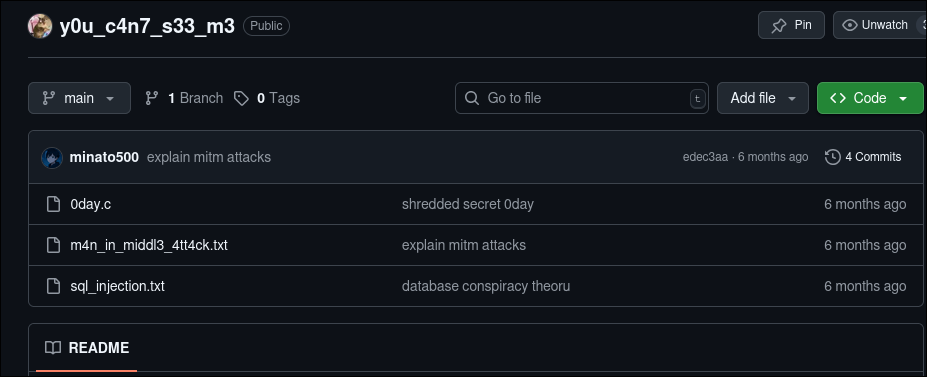
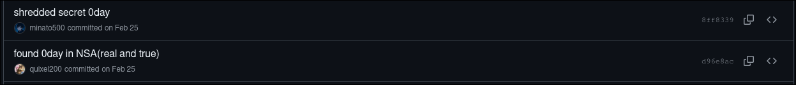

+++
date = '2025-08-04T09:53:27+05:30'
draft = false
title = 'Git Gud'
+++

# Git Gud

```
We intercepted a secret communication between 2 people, they seem to be planning a hack on google, can you find out their secret?

quixel200: hey man, I made a repo to share our theories. 

minato500: good job, just make sure its private. 

quixel200: wait its public!!! 

minato500: !!!?? Ill mangle the secret so nobody finds out, ill make the repo look normal. 

quixel200: we're so smart, nobody's gonna find out, right?

(they forgor to make it private in the end)
flag format: KALAM25{.....}
```


We have two usernames that we can infer from this conversation, `minato500` and `quixel200`. One of them says they made a 'repo' which refers to a github repository. A quick google search would have been sufficient to learn about this. 

Now we can start looking at repositories and you'll notice one of them stand out on the `quixel200` user called `y0u_c4n7_s33_m3`. 
- Firstly its named weirdly with leet speak. 
- secondly it says "you cant see me", when you clearly can. 



Now the repository does contain some rabbit holes and random text. But if you read the conversation carefully he says "Ill mangle the secret". Unfortunately changes made to a github repository are public and if we look at the commits we see a suspicious one. 



quixel200 claims that they found a zero day, and minato500 then proceeds to shred it, if we look at the file that was created and modified, we can see the encrypted flag, now you can either compile and run the program to get the flag or just decode from the ascii values, the xor doesn't do anything since we use the key 1. 

Final flag:

```
KALAM25{pu81ic_r3p0s_a4e_d4ng3rOus_Z2l0aXNjb29s}
```


